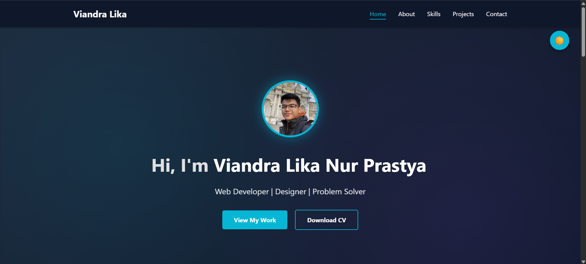

# Viandra Lika | Portfolio Website

Welcome to my personal portfolio website! This site showcases my skills, projects, and contact information in a modern, responsive design.

## 🌐 Live Demo

> [View the website](https://vdlnp.github.io/web-portfolio/) <!-- Add your live site link here -->

## 📸 Screenshot

 <!-- Replace with actual screenshot path -->


## 📄 Download My Resume

[Download Resume (PDF)](docs/Resume%20-%20Viandra%20Lika%20Nur%20Prastya.pdf)

## ✨ Features

- Responsive design for all devices
- Dark/Light mode toggle with preference memory
- Animated navigation and smooth scrolling
- Projects section with images and descriptions
- Contact form
- Accessible and semantic HTML

## 🚀 Getting Started

To run locally:

1. Clone this repository:
	```sh
	git clone https://github.com/yourusername/web-portfolio.git
	```
2. Open `index.html` in your browser.

No build tools required—just HTML, CSS, and JavaScript!

## 🛠️ Built With

- HTML5
- CSS3 (Flexbox, Grid, custom animations)
- JavaScript (vanilla)

## 📂 Folder Structure

```
index.html
style.css
README.md
images/
```

## 🙏 Acknowledgments

- [Google Fonts](https://fonts.google.com/)
- [Font Awesome](https://fontawesome.com/) (if used)
- Inspiration from modern portfolio designs

## 📬 Contact

- Email: viandralika@gmail.com
- [LinkedIn](https://linkedin.com/in/viandra-lika-nur-prastya-095038289/)
- [Github](https://github.com/vdlnp)

## 📝 License

This project is open source and available under the [MIT License](LICENSE).