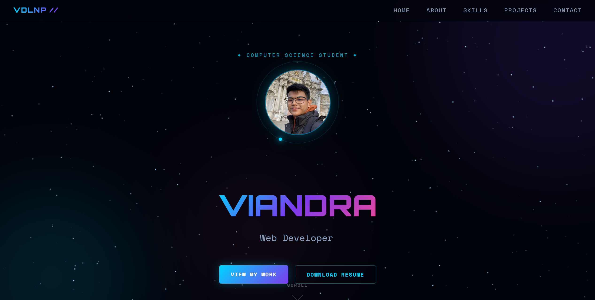

# 🚀 Viandra Lika | Space Portfolio

Welcome to my personal portfolio website — a space-themed showcase of my skills, projects, and contact information built with vanilla HTML, CSS, and JavaScript.

## 🌐 Live Demo

> [View the website](https://vdlnp.github.io/web-portfolio/)

## 📸 Screenshot



## 📄 Resume

[Download Resume (PDF)](docs/Resume%20-%20Viandra%20Lika%20Nur%20Prastya.pdf)

## ✨ Features

- Space-themed design with animated starfield background and nebula glows
- Typewriter effect cycling through multiple roles
- Smooth scroll-reveal animations on all sections
- Alternating image/text project detail pages per project
- Scroll progress bar and back-to-top button
- Active navigation highlighting on scroll
- Fully responsive for mobile, tablet, and desktop
- Semantic, accessible HTML

## 🚀 Getting Started

To run locally:

1. Clone this repository:
   ```sh
   git clone https://github.com/vdlnp/web-portfolio.git
   ```
2. Open `index.html` in your browser.

No build tools or dependencies required — just HTML, CSS, and JavaScript.

## 🛠️ Built With

- HTML5
- CSS3 (Flexbox, Grid, custom animations, CSS variables)
- JavaScript (vanilla)
- [Google Fonts](https://fonts.google.com/) — Orbitron, Space Grotesk, Space Mono

## 📂 Folder Structure

```
index.html
project-movie.html
smart-stock.html
rat-smash.html
random-number.html
README.md
images/
│   project-movie/
│       FR1.png … FR12.png
	smart-stock/
		SS1.png
docs/
│   Resume - Viandra Lika Nur Prastya.pdf
```

## 📬 Contact

- Email: viandralika@gmail.com
- [LinkedIn](https://linkedin.com/in/viandra-lika-nur-prastya-095038289/)
- [GitHub](https://github.com/vdlnp)

## 📝 License

This project is open source and available under the [MIT License](LICENSE).